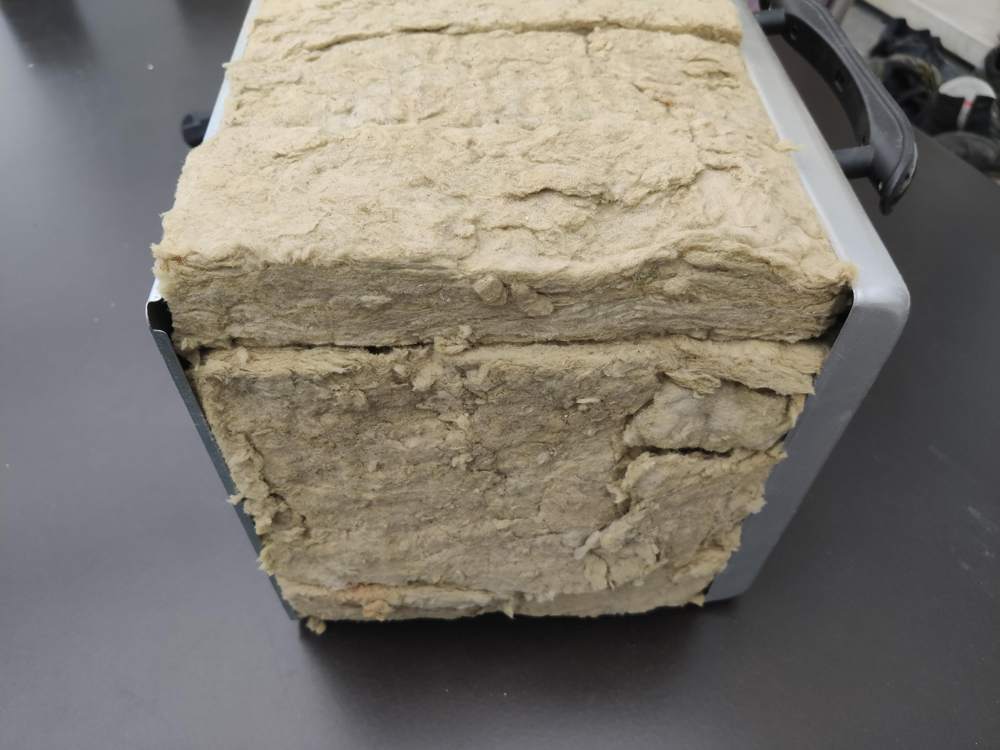

this project was 'forked' / copied from here:  
https://www.instructables.com/DIY-REFLOW-OVEN/  
  
created by 'Vulcaman' https://www.instructables.com/member/Vulcaman/  
www.vulcaman.de  
https://www.instagram.com/vulcaman/  
  
provided as 'open source' under the creative commons license:  
'Attribution-NonCommercial-ShareAlike 4.0 International (CC BY-NC-SA 4.0)'  

  

----

# DIY Reflow Oven

----

In this Instructable I want to show you how you can build your own SMD Reflow Oven for under 60€.

For a few month now, I decided to getting deeper in electronics und PCB-Design. However many SMD components you can buy are so tiny that they are really hard to solder. In the Industry, the standart is an Oven with a predefined Temperature Curve, a so called Reflow-Oven. However a Industrial grade Reflow Oven is really Expensive, so I have searched the Web and I saw a lot of People converting an old Pizza-Oven to a Reflow-Oven. Sadly I couldn't find one which will look that professional I would like. So I started to build my own reflow oven and decided to make it Open Source :-)

The reflow oven has the followings features:
<ul><li>1200 W of Power </li><li>Touch Screen </li><li>Modern GUI with Temperature Curve, Keypad and Parameters </li><li>Permanent storage of the settings (Stored in Flash) </li><li>STM32 Microcontroller (Blue Pill) </li><li>PID Temperature Controller </li><li>Overall Cost +-60€</li></ul>

<u><strong>Videos of the Reflow Oven </strong></u>

<ul><li>https://www.youtube.com/embed/BAKA0E_wQRk</li>
<li>https://www.youtube.com/embed/CvY7zXQO4RU</li></ul>

If you like my Instructable, please vote for me in the <a href="https://www.instructables.com/contest/automation2021/">Automation Contest</a>

Visit my <a href="https://www.instagram.com/vulcaman/" rel="nofollow noopener">Instagram</a>

Visit my <a href="https://www.vulcaman.de/" rel="nofollow noopener">Website </a>

<strong><u>UPDATE: </u></strong>

<strong>[27.03.2021] (V1.1) Fixed Integral Wind-Up in PID Controller, Actual Temp will draw longer now </strong>

<strong>--&gt; Updated STM32 Source Files</strong> 

---

## Step 1: Required Parts

<strong><u>The Base </u></strong>

For base the of the reflow oven you will need a cheap Pizza Oven, the more power, the better is oven is suited for an reflow oven, also an integrated ventilator is a plus point. I have found a used one on Ebay Kleinanzeigen for 20€ in my neighborhood which fits perfectly: 

¨NBSP;

<strong><u>Electronic Parts: </u></strong>

Here are all the requierd components, for the reflow oven
<table style="width: 100.0%;" border="2"><tbody><tr><th>Quantity</th><th>Description</th><th>Link</th><th>Price</th></tr><tr><td>1x</td><td>Nextion Display 3.5" Basic Version </td><td><a href="https://de.aliexpress.com/item/4001240732911.html?spm=a2g0o.productlist.0.0.61833db7Cz21rp&amp;algo_pvid=f80c5f3b-719d-42a8-9e57-86347c84af53&amp;algo_expid=f80c5f3b-719d-42a8-9e57-86347c84af53-0&amp;btsid=2100bdf116154822735398290ebc29&amp;ws_ab_test=searchweb0_0,searchweb201602_,searchweb201603_" rel="nofollow noopener">Aliexpress</a></td><td>25,32 € </td></tr><tr><td>1x</td><td>STM32F103C8T6 "Blue Pill" </td><td><a href="https://s.click.aliexpress.com/e/_AfFGsk" rel="nofollow noopener">Aliexpress</a></td><td>2,75 €</td></tr><tr><td>1x</td><td>MAX6675 Thermocouple Modul </td><td><a href="https://s.click.aliexpress.com/e/_ApxobS" rel="nofollow noopener">Aliexpress</a></td><td>2,28 € </td></tr><tr><td>1x</td><td>Level-Shifter 3.3V to 5V </td><td><a href="https://s.click.aliexpress.com/e/_AFqBnW" rel="nofollow noopener">Aliexpress</a></td><td>3,01€ for 10pcs </td></tr><tr><td>1x</td><td>5V Powersupply  </td><td><a href="https://s.click.aliexpress.com/e/_AUP3rQ" rel="nofollow noopener">Aliexpress</a></td><td>1,40€ </td></tr><tr><td>1x</td><td>SSR Relay 25A </td><td><a href="https://s.click.aliexpress.com/e/_ABwoOg" rel="nofollow noopener">Aliexpress</a></td><td>2,93€  </td></tr><tr><td>1x</td><td>Main Switch Green </td><td><a href="https://s.click.aliexpress.com/e/_9vae84" rel="nofollow noopener">Aliexpress</a></td><td>0,9€ </td></tr><tr><td>some</td><td>Terminals and Pinheaders </td><td> </td><td> </td></tr><tr><td>some</td><td>Wires </td><td> </td><td> </td></tr></tbody></table>
<strong><u> </u></strong>

<strong><u>Mechanical Parts: </u></strong>

You will need some screws to mount the display and the front panel<strong><u> </u></strong>
<table style="width: 100.0%;" border="2"><tbody><tr><th>Quantity</th><th>Description</th><th>Link </th></tr><tr><td>10x</td><td>
M3x16mm DIN912 
</td><td>local hardware store </td></tr><tr><td>some</td><td>
M3 Hex Nut 
</td><td>local hardware store </td></tr><tr><td>1x</td><td>
Sheet of Alu-Dibond / Aluminium for the Frontpanel
</td><td>local hardware store </td></tr></tbody></table>
<strong><u> </u></strong>

---

## Step 2: Remove All the Electronics From the Oven

At first you will need to remove everything of the old electronics from the oven. Take care about the sharp edges from the sheet metal!

---

## Step 3: Attach the Main Switch and the Nextion Display to the Frontpanel

I wanted a clean look of the reflow oven. No cables, no sharp edges, a oven which can be used as a tool.

So I have milled a front panel out of aluminum dibond, where I have placed the nextion display and a power switch

---

## Step 4: Build the Electronics

The electronics of the reflow oven is really simple. It is just a STM32 Bluepill board, with a MAX6675 thermocouple module, a Nextion 3.5" display and a solid state relay. You will find the schematic above. The level shifter in front of the nextion display is required, beacuse the STM32 works with 3.3V and the Nextion with 5V. I have mounted the electronics on a 3mm Aluminum sheet. 

---

## Step 5: Attach the Display to the Case

Now it's time to put the electronics back to the oven. Try to wire everything as nice as possible. However take a lot of care, because you will work with Main Voltage (230 V) which can potentially kill you!!!

---

## Step 6: Isolate It

For a better heat management, I have put some Rock Wool between the heating chamber and the outside of the oven. This way I could achieve that the oven only gets hand-warm on the outside of the oven.

---

## Step 7: ​Put the Original Enclosure Back on the Oven

---

## Step 8: Programm the Nextion Display

For the User Interface, I have designed my own GUI in the Nextion Editor. The GUI consist of four pages, which are shown below:

The first Page shows all the necessary Information which are important for the Reflow Soldering

 If you press on the Settings Button, you will be forwarded to the Parameters Page. There you can define all the Settings for the Profile

If you press on Advanced, you will be forwarded to the Advanced Settings, where you can adjust the PID-Parameters for the Heater

The Last Page is the KeyPad. The KeyPad will be opened when you press on the red Button of the Parameters

For a better explenation of the GUI, please watch the Youtube Video from the Beginning

##########################################################################

<u><strong>Flash the Nextion Display </strong></u>

To Flash the Nextion Display, you have to download the <a href="https://nextion.tech/nextion-editor/" rel="nofollow noopener">Nextion Editor</a>.

Then you just open the .HMI File and upload it to the Display 

<h3 class="sr-only">Attachments</h3><ul id="attachments" class="ible-files unstyled list-unstyled"><li class="file-info clearfix"><a class="thumb-wrapper" href="https://content.instructables.com/ORIG/FWQ/BBRR/KM7QNC05/FWQBBRRKM7QNC05.rar" download="REFLOW_HMI.rar"><noscript></noscript>REFLOW_HMI.rar</a>
<a href="https://content.instructables.com/ORIG/FWQ/BBRR/KM7QNC05/FWQBBRRKM7QNC05.rar" download="REFLOW_HMI.rar" class="btn pull-right">Download</a>
</li></ul>

---

## Step 9: Programm the STM32 + Source Code

For this Project, I have used a STM32F103C8T6 Microcontroller, which I have programmed with CUBEMX and STM32CubeIDE. The STM32 will handle the complete control of the Oven. However there are some important things you should know.

 <u>The GPIO Pin for the Relay </u>

To adjust the Output Power of the Heater I have used a Solid State Relay. While working with SSR Relays, you should know that they are often build with Triacs as switching Unit. This means that the SSR can only switch off when the Current is zero. The Heater is Controlled by 230 V 50 Hz Main Voltage so I have to switch way slower than 50 Hz for an better power control. So have set the PWM Frequecy on Pin PA9 to 1 Hz. That way, I could simply adjust the power by the dutycycle on Pin PA9.<u> </u>

<u>The PID Controller </u>

For the PID-Controller I have used the PID Implementation from the ARM CMSIS Package. You can find the documentation <a href="https://www.keil.com/pack/doc/CMSIS/DSP/html/group__PID.html" rel="nofollow noopener">here </a>

<u>Write of the parameters to the Flash Memory </u>

To store the parameters permanently to the STM32, the parameters will be automatically stored to the Flash Memory of the STM32. Here I have used the Flash library from <a href="https://www.youtube.com/watch?v=BKgh896Bj8Q" rel="nofollow noopener">Controllers Tech </a>

##############################################################

<u><strong>Flash the STM32 </strong></u>

Because it much more complicated to set up the STM32CUBEIde and include all the libraries compared to the Arduino IDE, I have precompiled the C-Code as a .bin file. So all you have to do is to flash the .bin file with the <a href="https://www.st.com/en/development-tools/stsw-link004.html" rel="nofollow noopener">ST-Link-Utility</a> to the STM32. For flashing the STM32 you will need a ST-Link Programmer

You can download all the Source Files below:

Or download them from <a href="https://drive.google.com/drive/folders/1B09TK_5CR2aG5pWbvl-CoUNYtiuce62N?usp=sharing" rel="nofollow noopener">Google Drive</a>

 

<u> </u>

<h3 class="sr-only">Attachments</h3><ul id="attachments" class="ible-files unstyled list-unstyled"><li class="file-info clearfix"><a class="thumb-wrapper" href="https://content.instructables.com/ORIG/F01/FRHQ/KM7QNCCF/F01FRHQKM7QNCCF.rar" download="Reflow_Oven_STM32_Source.rar"><noscript></noscript>Reflow_Oven_STM32_Source.rar</a>
<a href="https://content.instructables.com/ORIG/F01/FRHQ/KM7QNCCF/F01FRHQKM7QNCCF.rar" download="Reflow_Oven_STM32_Source.rar" class="btn pull-right">Download</a>
</li><li class="file-info clearfix"><a class="thumb-wrapper" href="https://content.instructables.com/ORIG/FWN/WJ7M/KM7QNCCG/FWNWJ7MKM7QNCCG.rar" download="Reflow_Oven_Bin_File.rar"><noscript></noscript>Reflow_Oven_Bin_File.rar</a>
<a href="https://content.instructables.com/ORIG/FWN/WJ7M/KM7QNCCG/FWNWJ7MKM7QNCCG.rar" download="Reflow_Oven_Bin_File.rar" class="btn pull-right">Download</a>
</li><li class="file-info clearfix"><a class="thumb-wrapper" href="https://content.instructables.com/ORIG/FPY/9ZOL/KMQBEQVV/FPY9ZOLKMQBEQVV.rar" download="Reflow_Oven_STM32_V1_1.rar"><noscript></noscript>Reflow_Oven_STM32_V1_1.rar</a>
<a href="https://content.instructables.com/ORIG/FPY/9ZOL/KMQBEQVV/FPY9ZOLKMQBEQVV.rar" download="Reflow_Oven_STM32_V1_1.rar" class="btn pull-right">Download</a>
</li><li class="file-info clearfix"><a class="thumb-wrapper" href="https://content.instructables.com/ORIG/F0C/S75C/KMQBERFC/F0CS75CKMQBERFC.rar" download="Reflow_Oven_STM32_SOURCE_V1_1.rar"><noscript></noscript>Reflow_Oven_STM32_SOURCE_V1_1.rar</a>
<a href="https://content.instructables.com/ORIG/F0C/S75C/KMQBERFC/F0CS75CKMQBERFC.rar" download="Reflow_Oven_STM32_SOURCE_V1_1.rar" class="btn pull-right">Download</a>
</li></ul>

---

## Step 10: Pictures From Soldering

Here you will see some results from soldering. As you can see the soldering is quite nice :-)

I have used Sn63Pb37 Solder Paste for this PCB. In the future I will update this step with some more PCBs which I have soldered. Also take a look at my <a href="https://www.instagram.com/vulcaman/" rel="nofollow noopener">Instagram</a> for more pictures.

<u><strong>### If you have any questions, feel free to contact me ### </strong></u>

